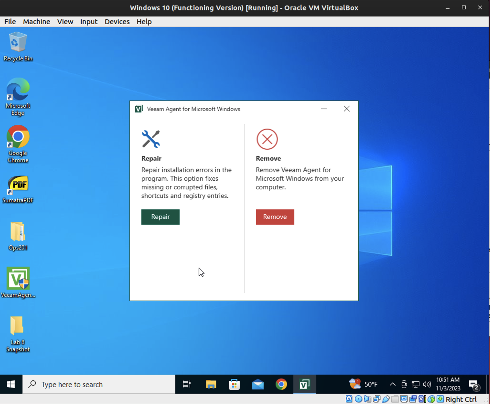
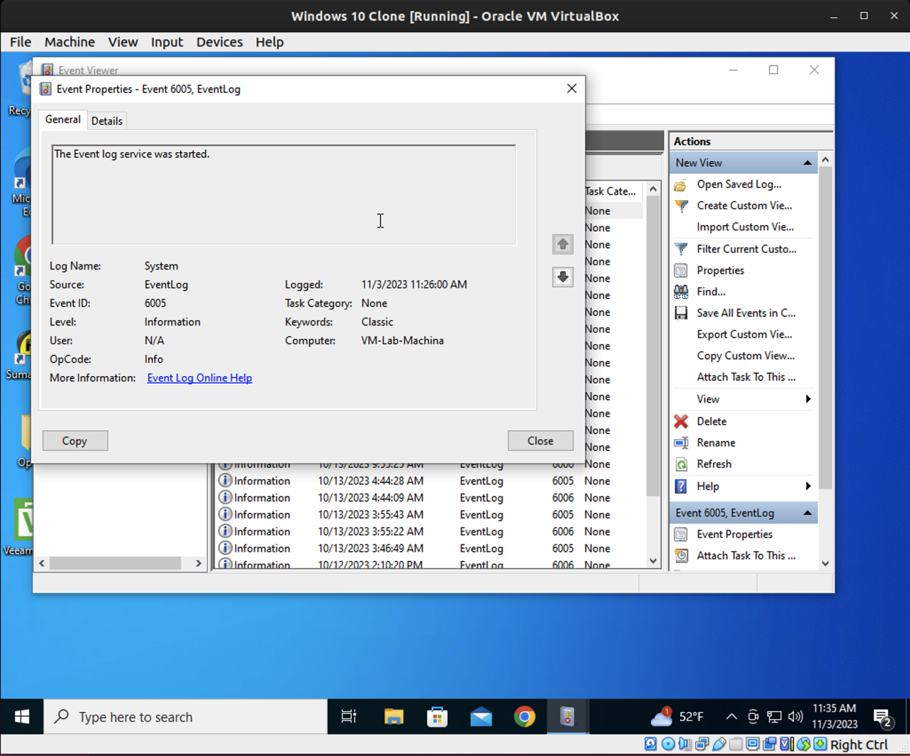
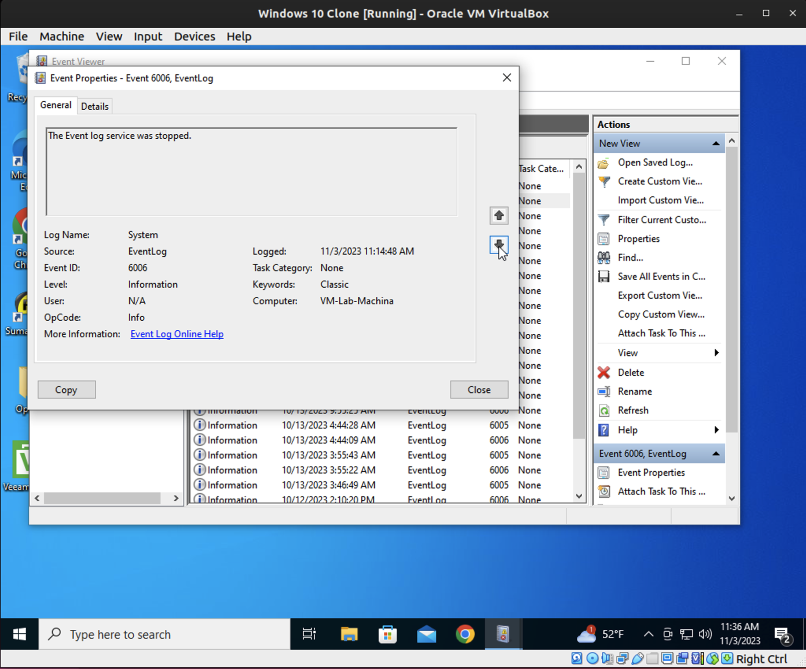
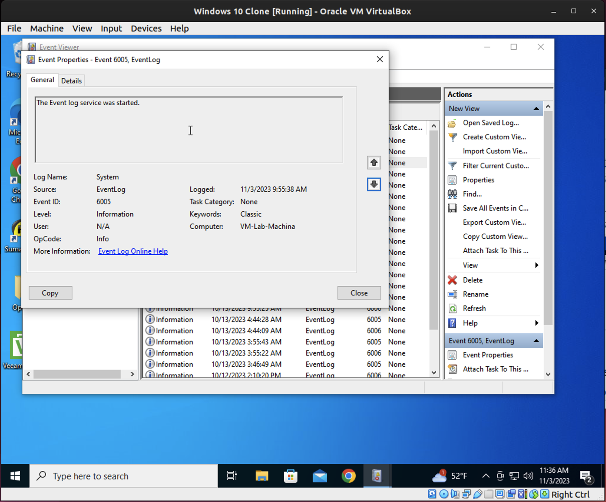
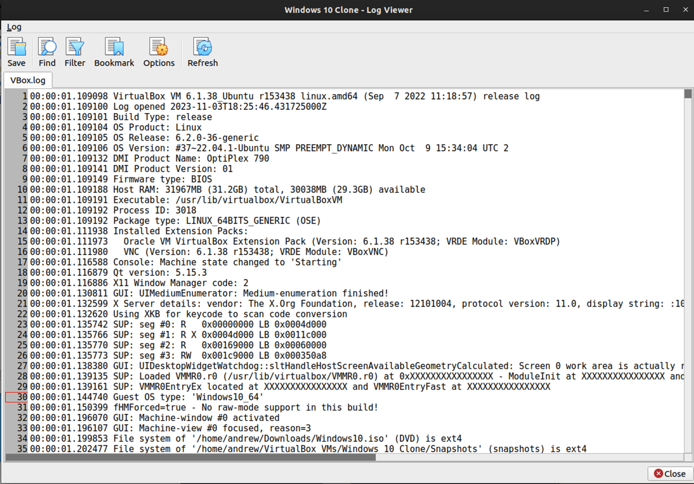
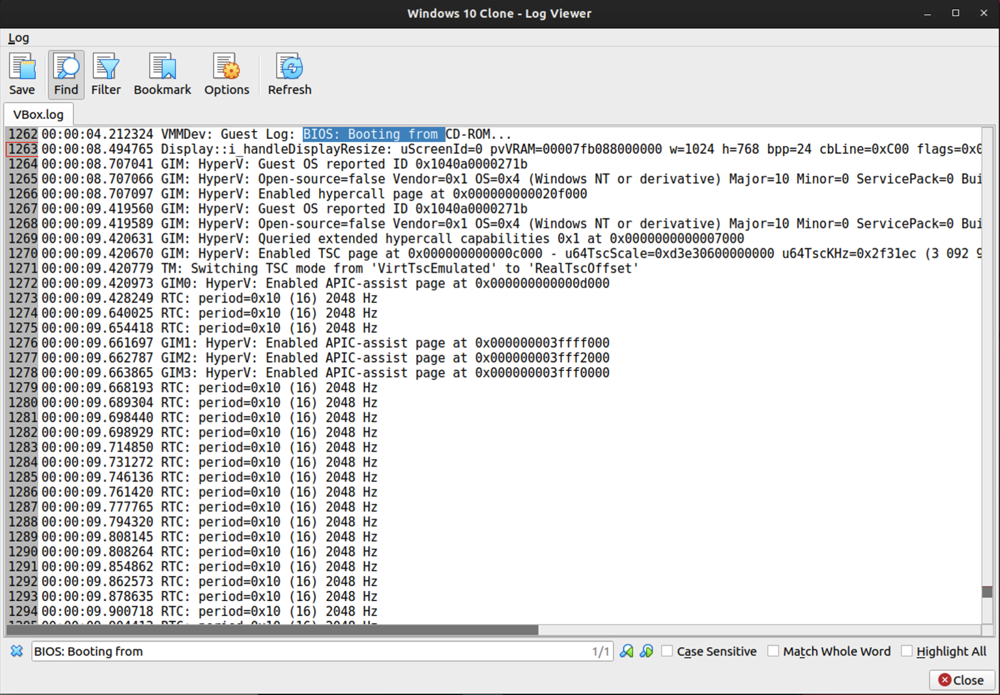
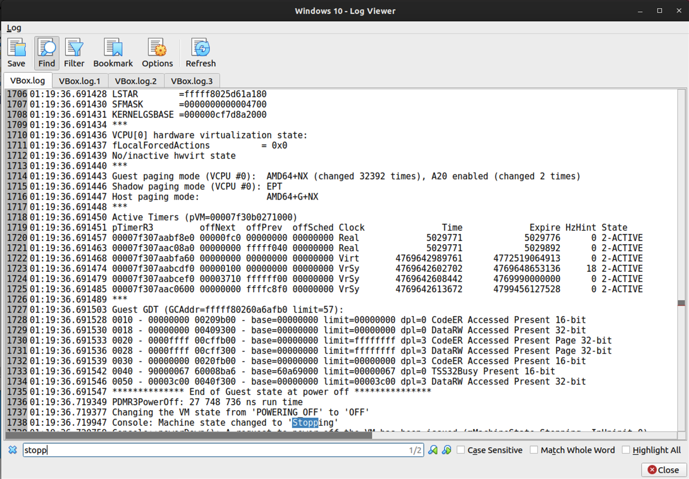
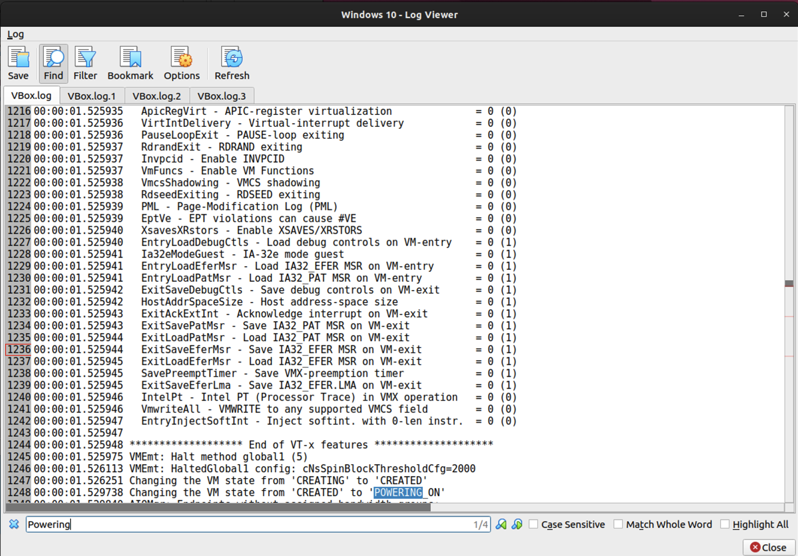
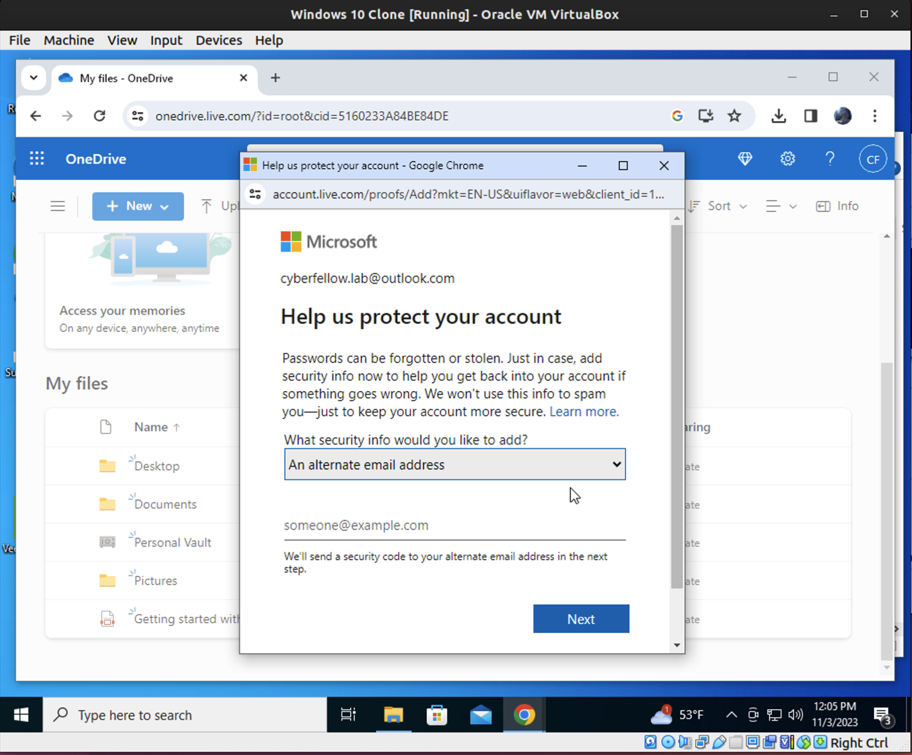

# Lab 10

**Veeam Backup**

- What did I learn?
  - I learned how to use Veeam to backup specific file locations on my VM which is applicable across systems running Windows.

- What challenges did I encounter?
- Veeam is kind of clunky.  But whatever.
  - I downloaded and installed the software, it ran the wizard for the initial image but I stopped it because it didn't give the file level backup option.  This seems to have crashed the program so I have to uninstall and reinstall it...
    - I had to uninstall and re-install this program like 5 times...
    - Then I learned to access the program via system tray icon and not the desktop icon.

- Create a new disk partition in which to save the backup image.
- Create a new backup job.
- Run the backup job.

- What challenges do you anticipate by using this procedure at increasing scale?
  - Time to backup will increase with the amount of data being backed up.  This is the main challenge I see.

**Virtual Box VM Tools - Log System, Clone**
- Define clone types
  - Full clone: an exact copy (including all virtual hard disk files) of the original virtual machine will be created.
  - Linked clone: a new machine will be creaed, but the virtual hard disk files will be tied to the virtual hard disk files of original machine and you will not be able to move the new virtual machine to a different computer wihtout moving the original as well.
    - If you create a Linked clone then a new snapshot will be created in the original virtual machine as part of the cloning process.

- Everything was present and accounted for as well as properly functioning
- Cloning is a useful feature for lab work because we can make functional changes that can be used in new lab environments and if we break things we can revert back to the original system.

- Logged Events: Screen Shots
- Host system information: Screen Shots
- Log Analysis Tools: Save, Find, Filter, Bookmark, Options, Refresh
  - These are similar tools to those found in Windows Event Viewer.
- I don't think ALL software has looging or consoling as a default but many have debug modes and such that can be accessed with the proper permissions.

**OneDrive Automated Backup**
I don't want to give my phone number or alternate email address to OneDrive...Unless I have to.  I got the desktop app and added files to that.  Obviously this is a great tool for file sharing within an enterprise environment because it is cloud based and avaliable to all users who have permission but it does come with a few risks attached.  Because it is in the cloud.

