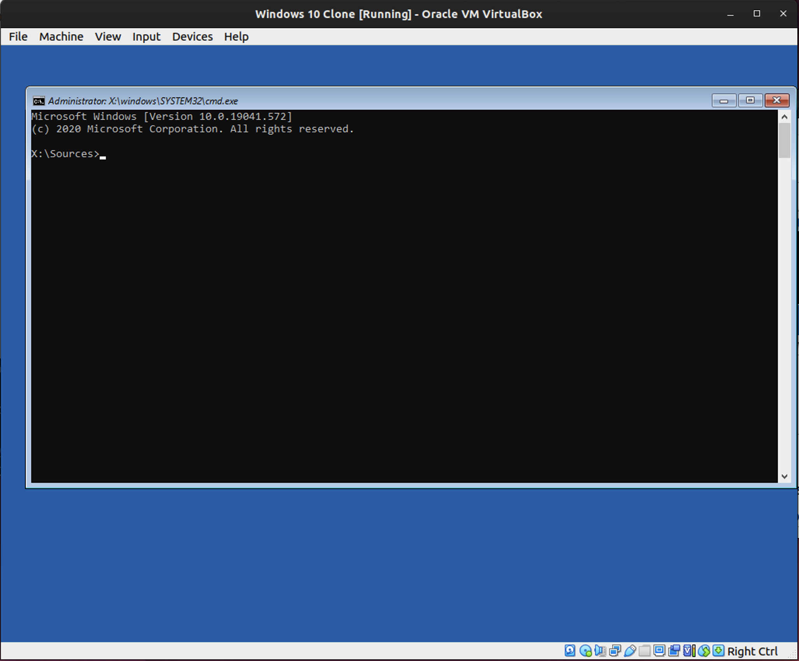
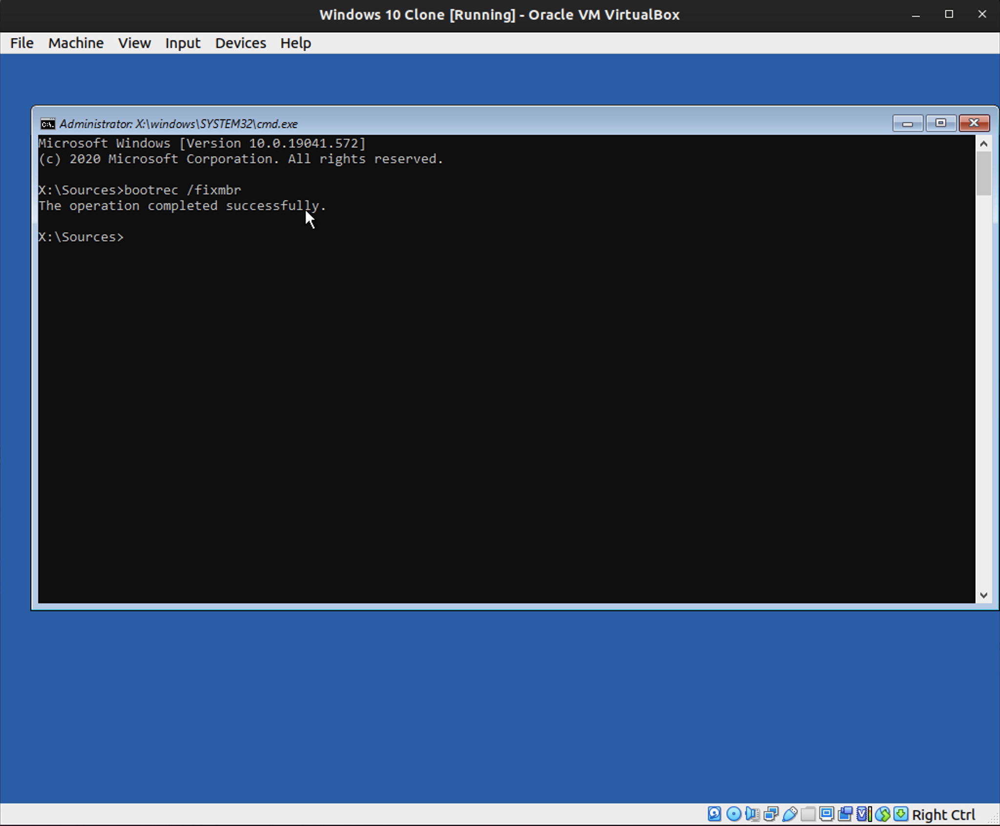
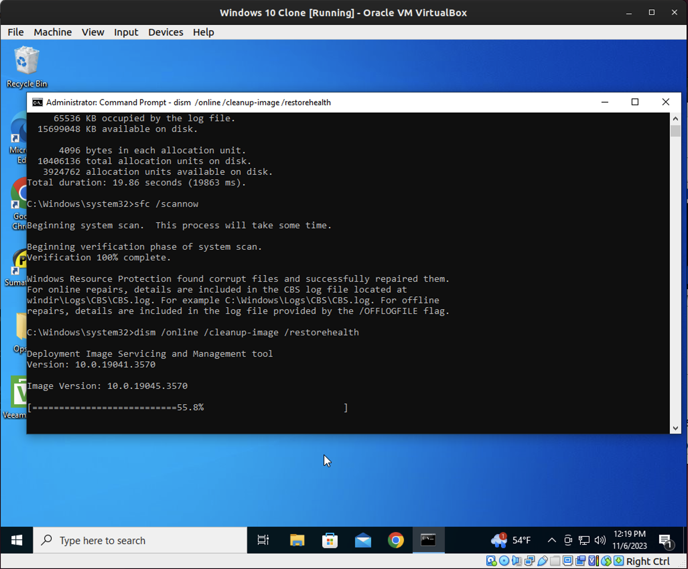
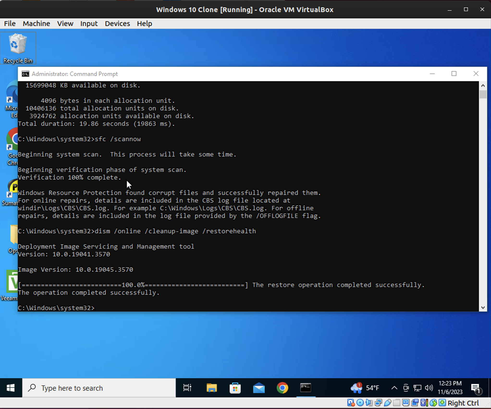
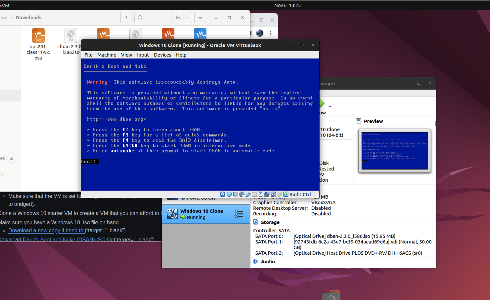
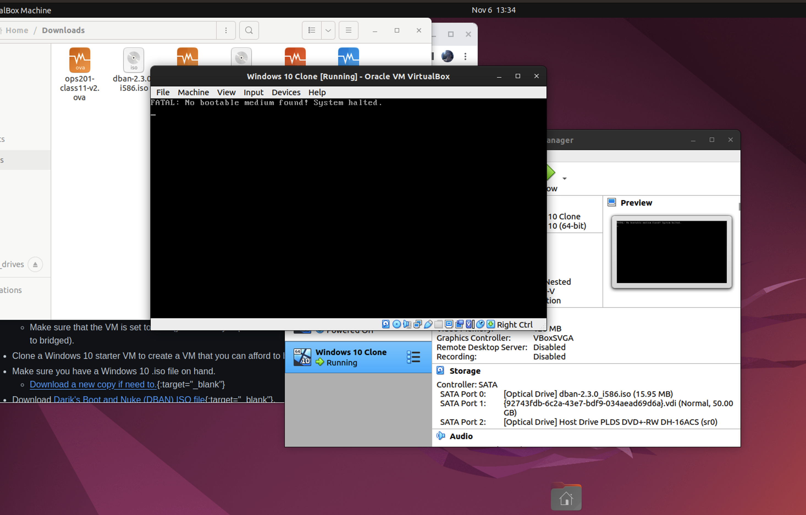
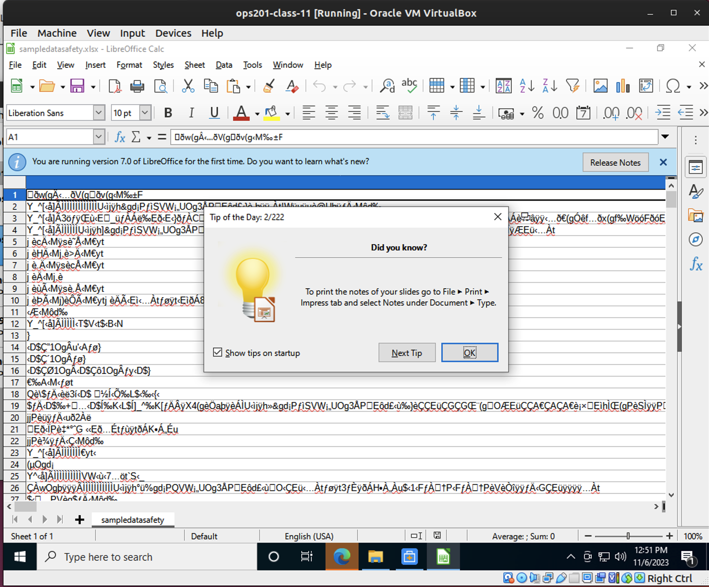
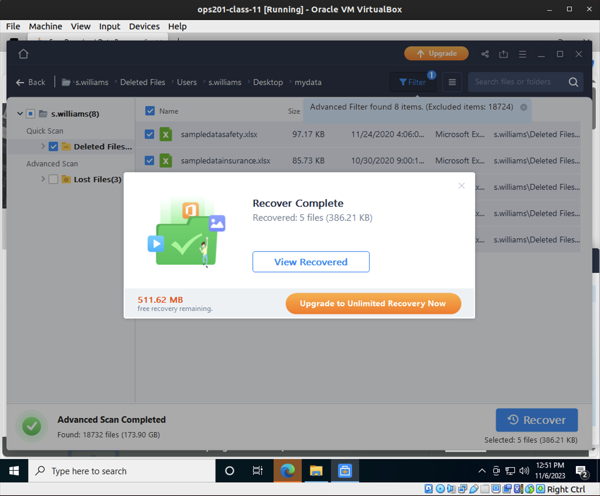
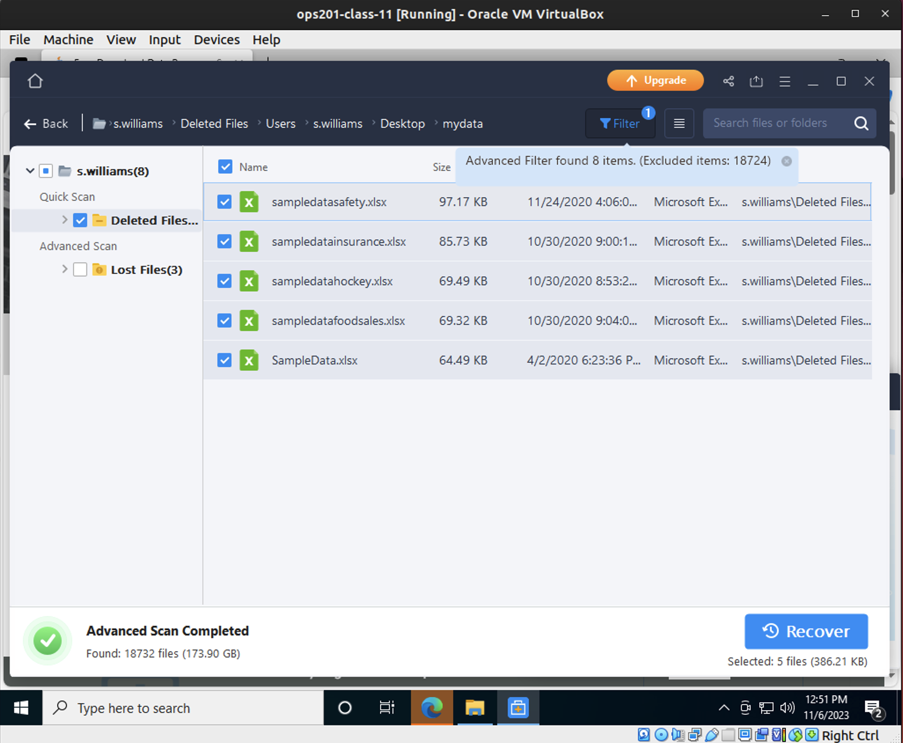
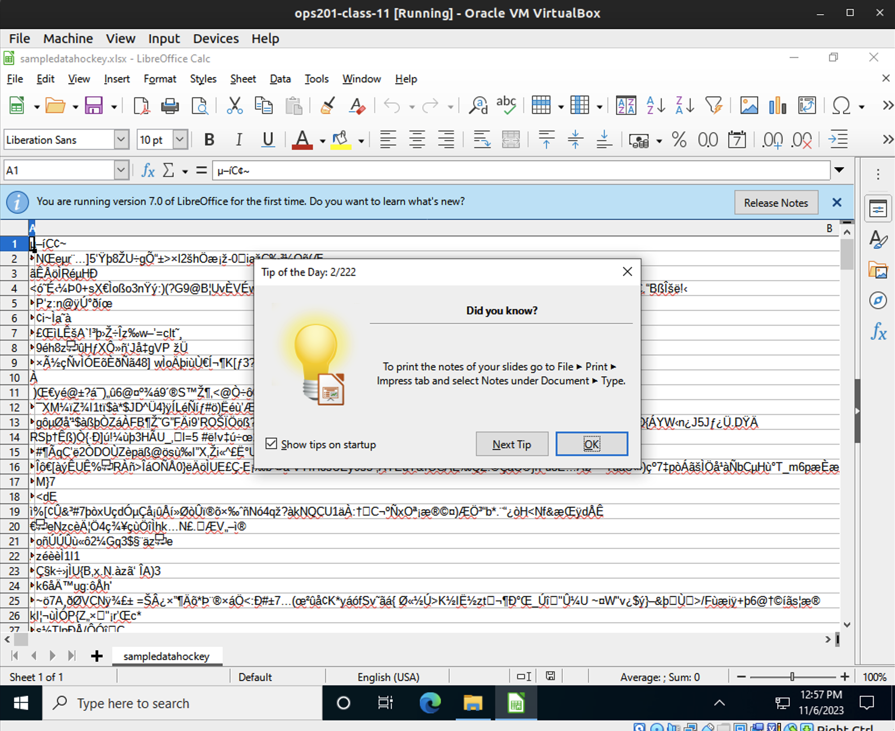

# Lab 11

**Data Restoration**

- This process was kind of a pain in the behind.  The recovery tool is cool but the way I had to find the files was really unintuitive.  I initially searched for .xlsx files but it seems that the tool couldn't find them that way.  So I then realized that I could run the advanced sort tool and looked for all excel files.

**Data Corruption Repair**

- Challenges?  
  - No.  Everything went smoothly once I realized how to do the lab.  I initially tried doing this on the lab11 ova and was having all kinds of problems.  Once I figured out the lab objectives were out of order and did the file recovery first then switched to the cloned windows 10 vm everything went fine.

- What is `/online`?
  - This specifies that the operation should be performed on the currently running operating system, referred to as the "online" operating system.

**Secure Data Disposal**

- Challenges? 
  - No.  This was pretty straight forward.

