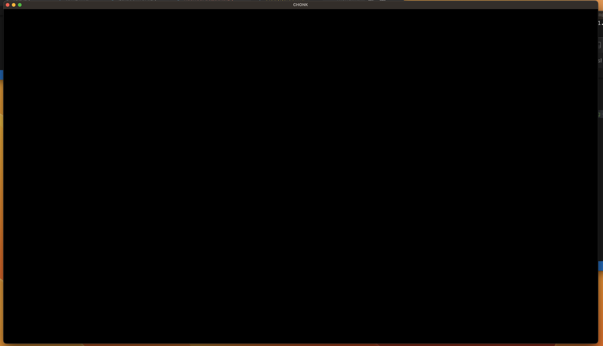
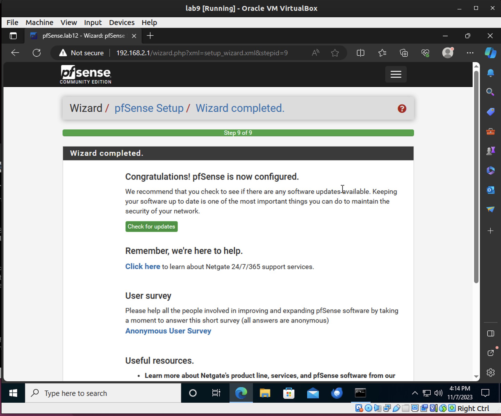
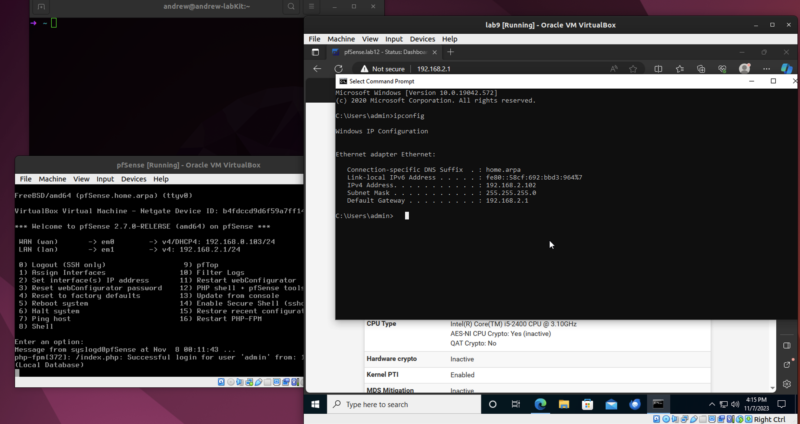
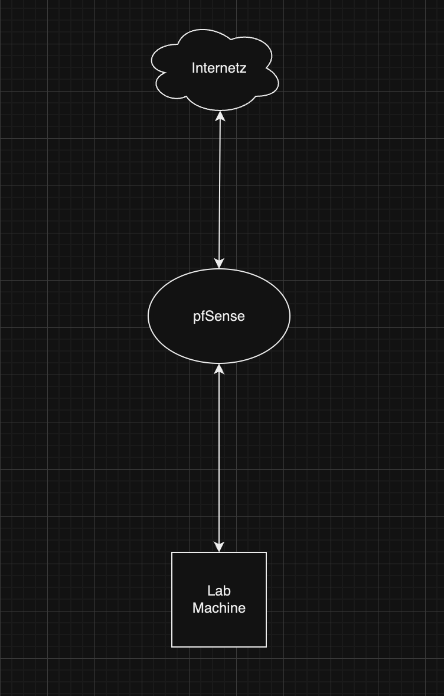
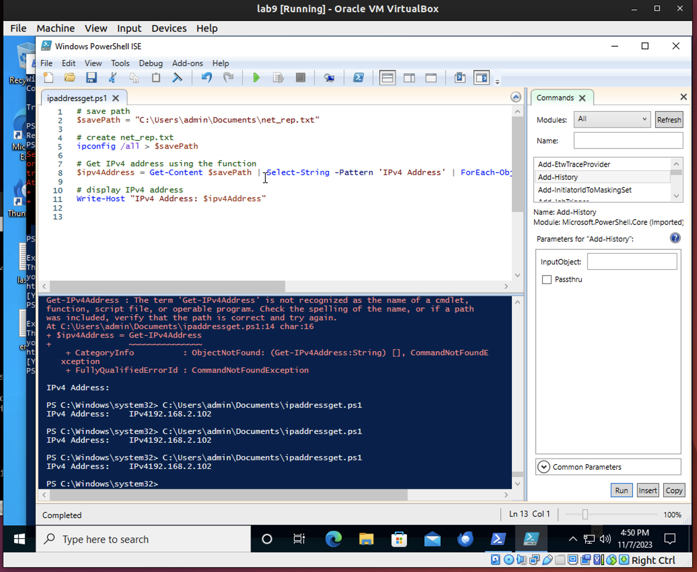

# Lab 12

I had a ton of issues getting my pfSense to work and the disk space on my lab computer was getting to full.  Overall a really problematic lab.  

**pfSense, VM Network, Diagram**

This was when the lab computer completely gave up on me:

Finally logged into the 192.168.2.1 pfSense configuration...after like an hour of troubleshooting:

Proof I did the things:

Behold, the diagram:

**resources**
[pfsense installation and setup](https://www.how2shout.com/how-to/install-pfsense-VirtualBox-linux-vmware-player.html)