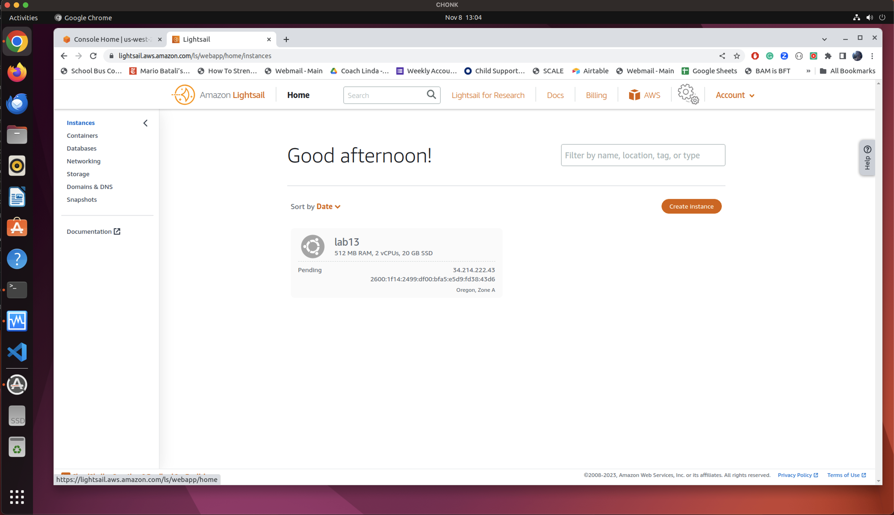
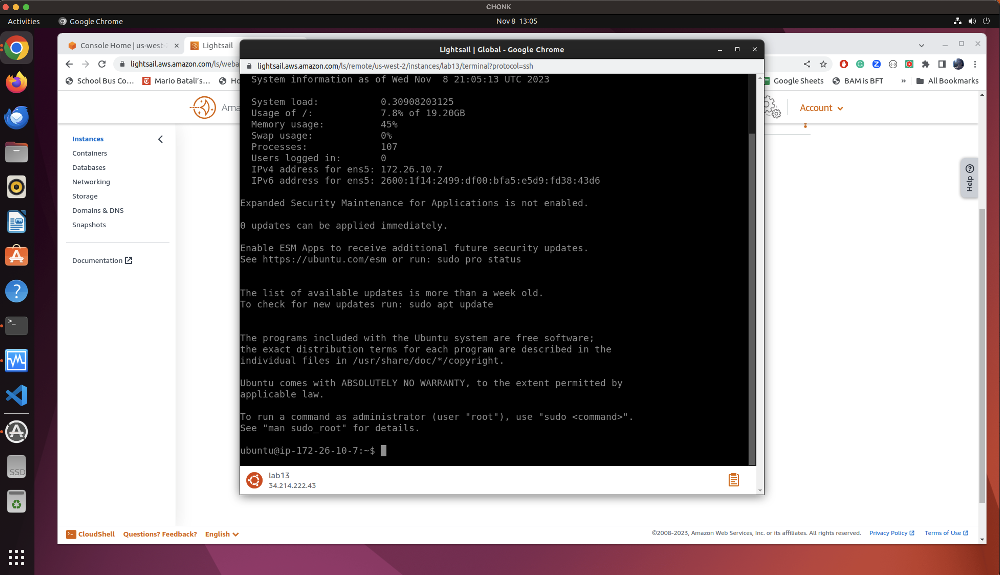
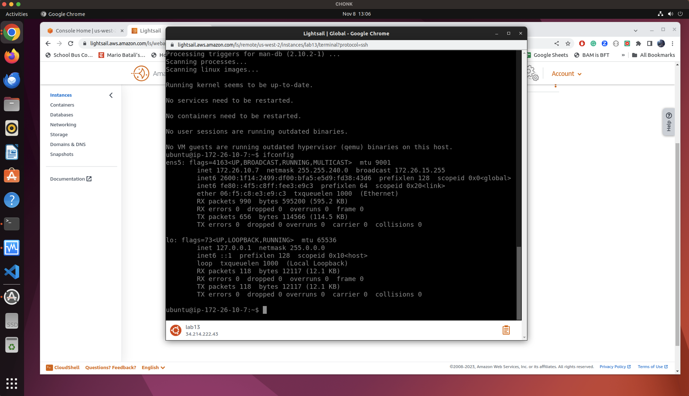
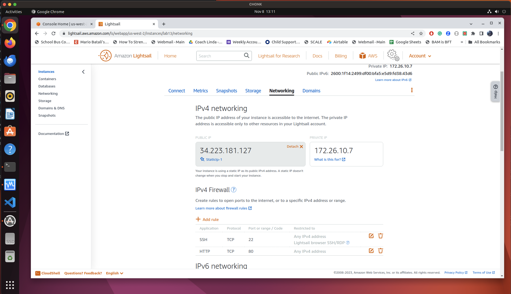
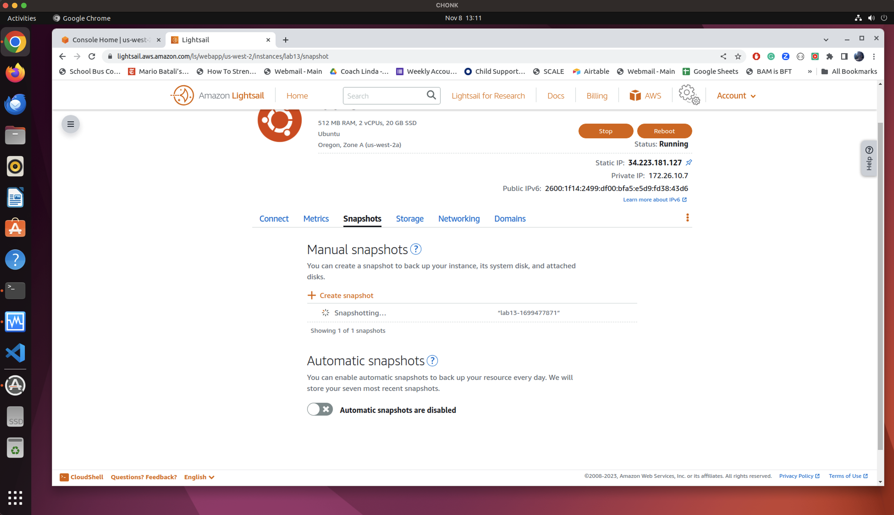
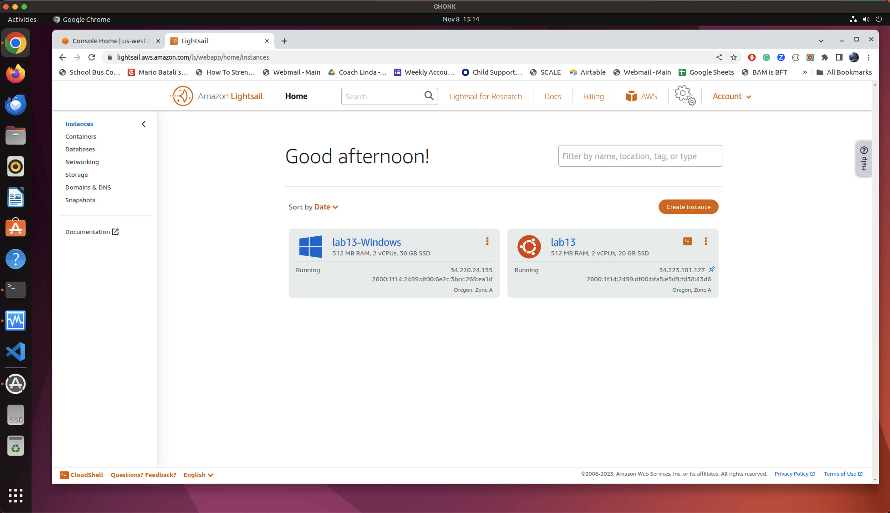
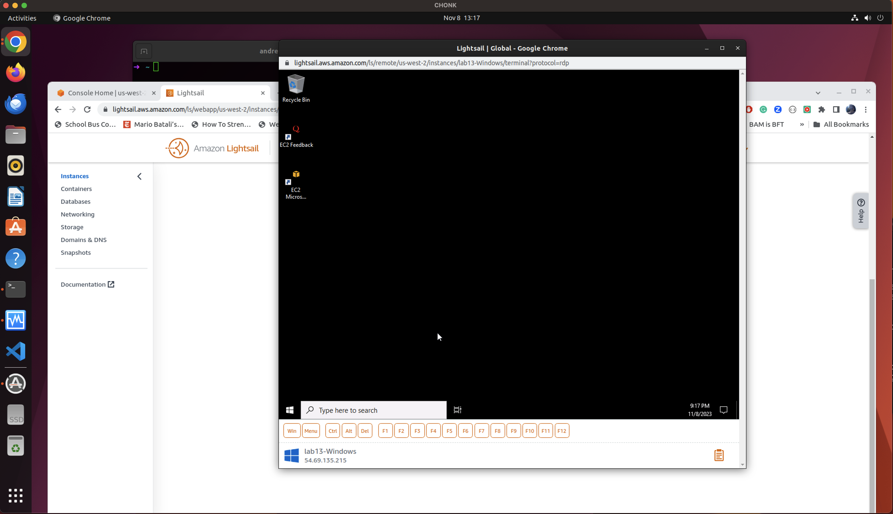
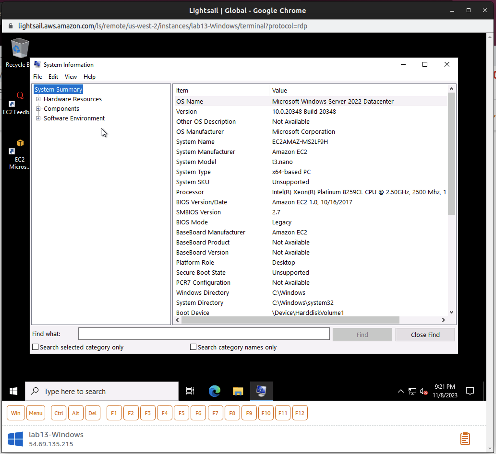
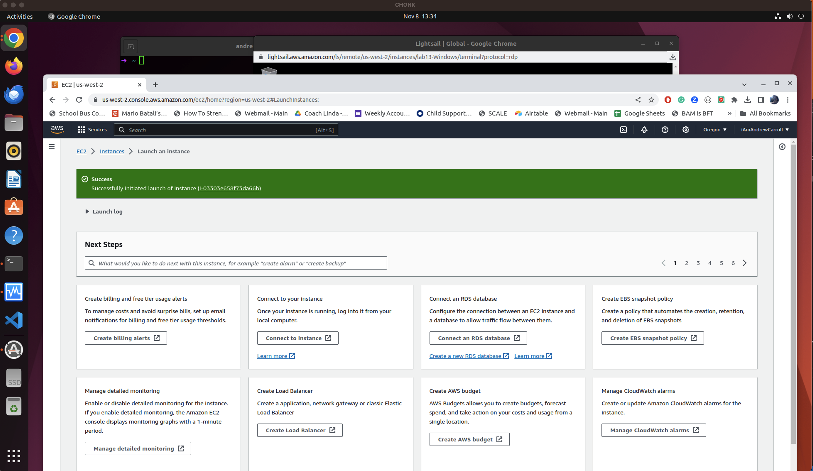
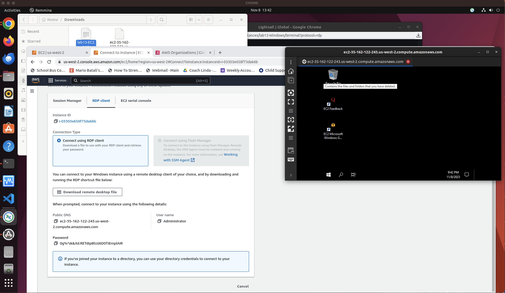

# Lab 13

**Lightsail**

- The Linux terminal operations via Lightsail seem pretty similar to what I've experienced on my Ubuntu Lab setup and VMs.  

- The versatility of being able to access a cloud VM from anywhere is useful to me as an Ops student because it has the potential to allow me to access a custom toolbox I creat from any terminal setting I want at any time.

- The security implications of having a computer system that can be accessed from anywhere are pretty stark.  In some ways it opens up a lot of vulnerabilities that would not be present in a system that is only accessible from a local network.  However, it also allows for a lot of flexibility in terms of being able to access a system from anywhere.  I think the security implications are worth the tradeoff in this case.  Having a strong key pair is also critical and still presents a pretty difficult barrier to entry for anyone trying to access the system.

- The only indication I ccould see that this was an AWS hosted computer is Amazon EC2 listed as the system manufacturer.

**AWS EC2**
- Build a Solution
  - Launch a Virtual Machine (with EC2)
  - Windows Server 2022 Base
  - t2.micro (free tier)
  - create new key pair (openSSH)
  - Allow RDP from My IP (for now)
  - Launch Instance
  - Login to instance via RDP

