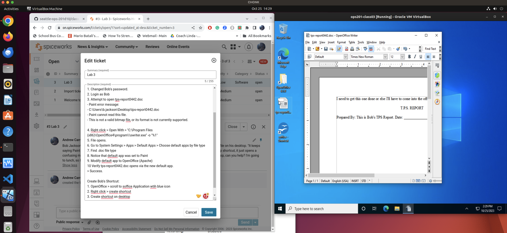

# Lab 3

## Scenario

Bob Jackson, a company sales lead, contacted you by phone to let you know he's unable to access his report file on his desktop. "It keeps saying Paint won't open, something like that. Then when I go to launch Apache OpenOffice through the desktop shortcut, it just opens a confusing menu instead of launching the text editor program that I need to edit the report file. It's on my desktop, can you help? I'm going to lunch, so I'll just check with you when I'm back."

## Objectives

- Help Bob resolve the technical issues on his Windows 10 PC.
  - Repair the computer so that Bob can open `tps-report0442` from his user profile on his desktop with Apache OpenOffice suite.
  - Create a shortcut to the Apache Word Processor on Bob's desktop.
  - If you changed any settings, notify Bob via Spiceworks.
- Complete a Spiceworks ticket from inception to resolution.

### Resolution Steps:
1. Changed Bob's password.
2. Login as Bob
3. Attempt to open tps-report0442.doc
   - Paint error message:
   - C:\Users\b.jackson\Desktop\tps-report0442.doc
   - Paint cannot read this file.
   - This is not a valid bitmap file, or its format is not currently supported.

4. Right click > Open With > "C:\Program Files (x86)\OpenOffice4\program\\swriter.exe" -o "%1"
5. File opens.
6. Go to System Settings > Apps > Default Apps > Choose default apps by file type
7. Find .doc file type
8. Notice that default app was set to Paint
9. Modify default app to OpenOffice (Apache)
10. Verify tps-report0442.doc opens via the new default app.
    - Success.

Create Bob's Shortcut:
1. OpenOffice > scroll to soffice Application wtih blue icon
2. Right click > create shortcut
3. Create shortcut on desktop

I deleted the VM prior to seeing the submission instructions that I may need more screenshots.  However, this screenshot is as comprehensive as it gets.