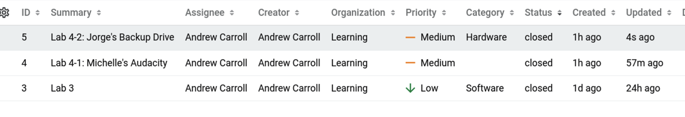

# lab 4

### Scenarios

**Ticket 1: Michelle’s Audacity**

Michelle Garcia writes: “Hey all, I’m having trouble with Audacity today. It doesn’t launch correctly. I need to import the audio-project file on my Desktop into Audacity for editing, but I’m stuck.”

**Ticket 2: Jorge’s Backup Drive**

Jorge Thompson writes: “Hello IT team, I’ve been running out of hard drive space so I had your weekend technician add a new internal hard drive. We were working on this pretty late so we didn’t finish the process. I know it’s all plugged in physically, but Windows doesn’t show the new hard drive. Can you help?”

