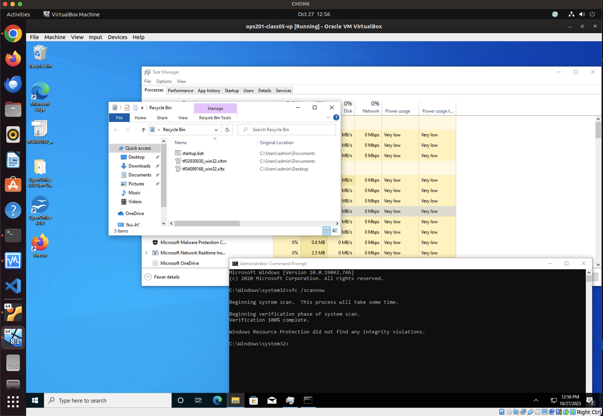
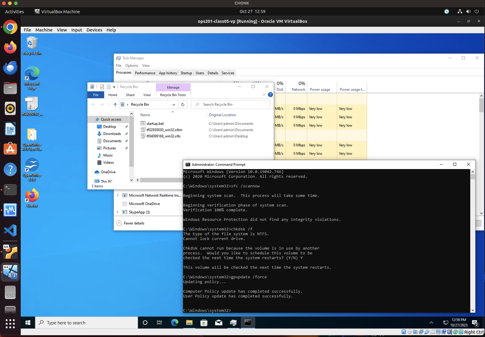
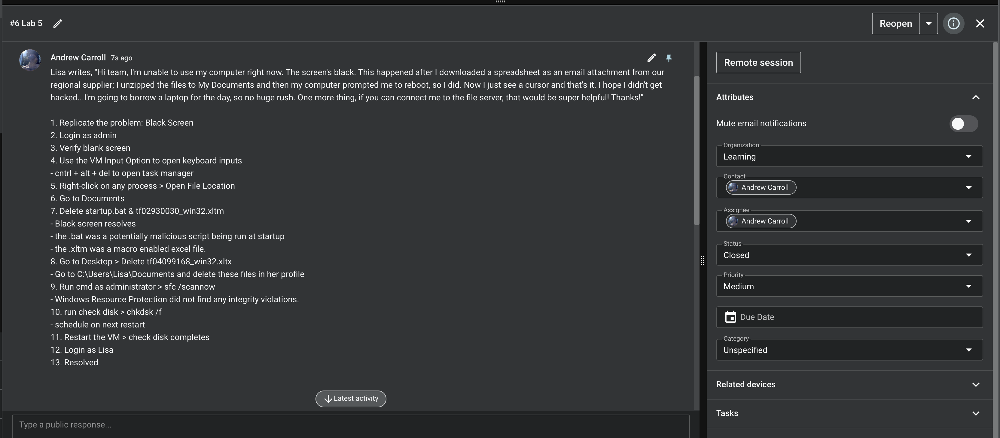

# Lab 5

**Notes:**
Lab 5 VM IP: 10.0.2.15

**Server**
lo:
Fileserve IP: 127.0.0.1
Fileserve Netmask: 255.0.0.0

<!-- This is the proper information to use for networking and remoting -->
enp0s3: 
Fileserve IP: 10.0.2.4
Fileserve Netmask: 255.255.255.0
Fileserve Broadcast: 10.0.2.255

**Lisa Lab**

1. Replicate the problem: Black Screen
2. Login as admin
3. Verify blank screen
4. Use the VM Input Option to open keyboard inputs
- cntrl + alt + del to open task manager
5. Right-click on any process > Open File Location
6. Go to Documents
7. Delete startup.bat & tf02930030_win32.xltm
- Black screen resolves
- the .bat was a potentially malicious script being run at startup
- the .xltm was a macro enabled excel file.  
8. Go to Desktop > Delete tf04099168_win32.xltx
- Go to C:\Users\Lisa\Documents and delete these files in her profile
9. Run cmd as administrator > sfc /scannow
- Windows Resource Protection did not find any integrity violations.
10. run check disk > chkdsk /f
- schedule on next restart
11. Restart the VM > check disk completes
12. Login as Lisa
13. Resolved

**System File Checker**
- `sfc /scannow`
- A built in windows utility that allows you to scan and repair corrupted system files.

**Check Disk**
- `chkdsk /f`
- A built in windows utility that allows you to scan and repair corrupted files on a disk.

**Group Policy Update**
- `gpupdate /force`
- A built in windows utility that allows you to force immediate group policy updates.

**Samba Share**

sudo apt-get intstall samba

turn on file and printer sharing in Windows Settings (search share)

Mount the drive via command prompt
`net use S: \\10.0.2.4\sambashare /user:fileserv fileserv /persistent:yes`

This was a brutal lab that caused a lot of friction.

