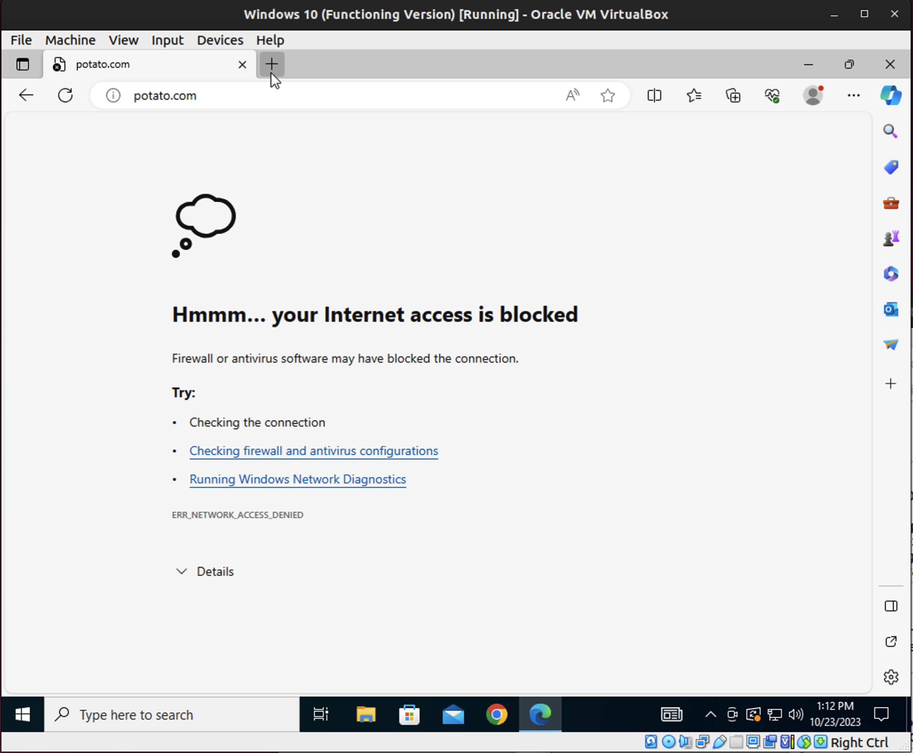

# Lab 5

**Windows Defender**

1.  type "Windows Defender" in the search bar
2. click on the shield icon
3. advanced settings
4. Outbound Rules
5. New Rule (right hand side of window)
6. Custom
7. Browse > C:\ProgramFiles (x86)\Microsoft\Edge\Application\msedge.exe
8. Block the connection and follow the wizard
9. Create the rule

**Antivirus**

**Task Manager**
- When I ended the explorer.exe task the task bar and icons all disappeared.
- Restart explorer.exe by going to file > run new task > explorer.exe
  - Taskbar and icons all came back
  - explorer.exe is the application gui interface that most users are engaging with.

