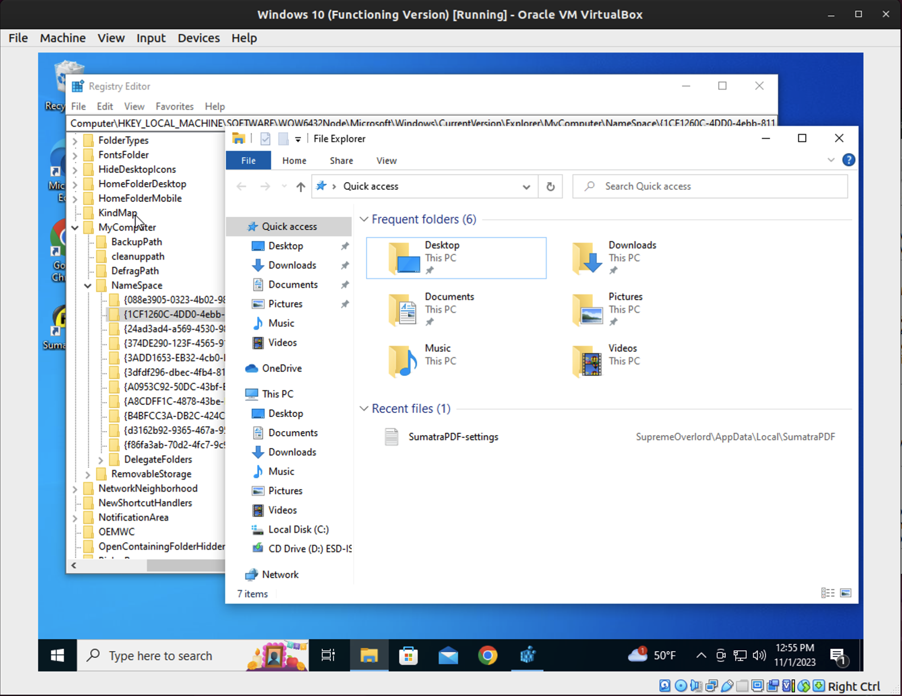
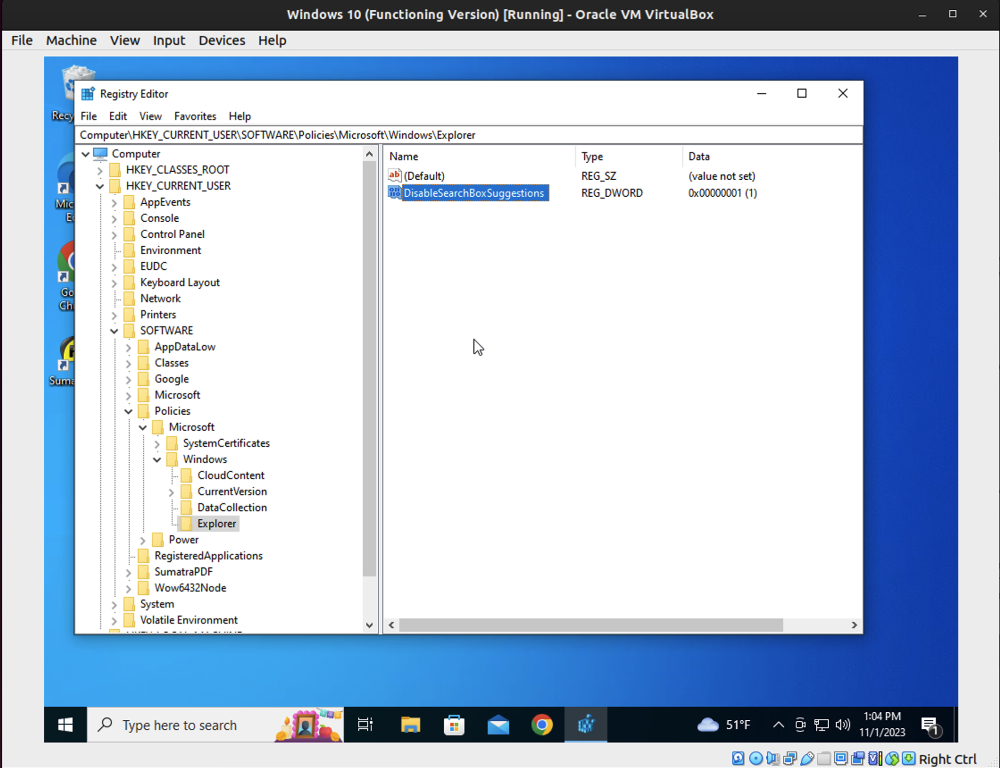
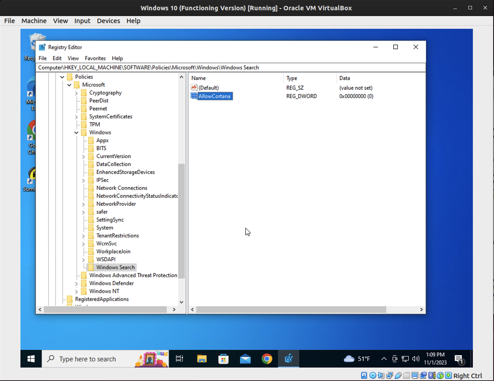
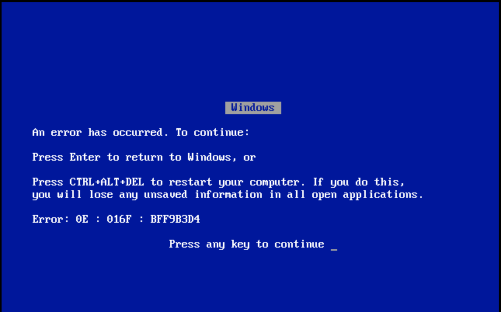
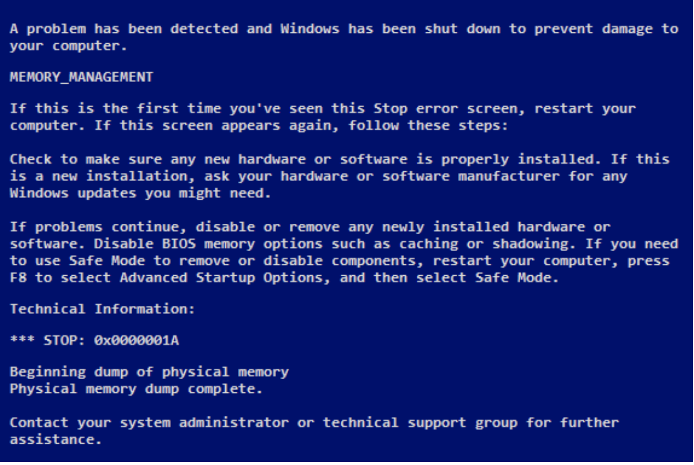

# Lab 8

**Part 1: Registry**

- Registry Files: `C:\Windows\System32\Config\`
- Windows Registry Hacks:
  - Switch windows with a single click on task bar
    - HKEY_CURRENT_USER\Software\Microsoft\Windows\CurrentVersion\Explorer\Advanced
      - Switch windows with a single click on the taskbar
        - Right click > New > DWORD (32-bit) > "LastActiveClick" > Double click > Change Value Data to 1 > OK
  - Remove 3D Object from PC
    - HKEY_LOCAL_MACHINE\SOFTWARE\Microsoft\Windows\CurrentVersion\Explorer\MyComputer\NameSpace
      - Locate {0DB7E03F-FC29-4DC6-9020-FF41B59E513A} in NameSpace
      - Right click > Delete
    - KEY_LOCAL_MACHINE\SOFTWARE\Wow6432Node\Microsoft\Windows\CurrentVersion\Explorer\MyComputer\NameSpace
      - Locate {0DB7E03F-FC29-4DC6-9020-FF41B59E513A} in NameSpace
      - Right click > Delete
  - Remove OneDrive from PC
    - Control Panel > Programs > Programs and Features > Uninstall OneDrive
  - Disable Bing
    - Computer\HKEY_CURRENT_USER\SOFTWARE\Policies\Microsoft\Windows\Explorer
    - Right click > New > DWORD (32-bit) > "DisableSearchBoxSuggestions" > Double click > Change Value Data to 1 > OK
  - Disable Cortana
    - Computer\HKEY_CURRENT_USER\SOFTWARE\Policies\Microsoft\Windows\Explorer
    - Right click > New > DWORD (32-bit) > "AllowCortana" > Double click > Change Value Data to 0 > OK

**Part 2: System Crash Analysis**

- Error: 0E : 016F : BFF9B3D4
  - 0E: The current thread attempted to access a pageable (or completely invalid) address at an interrupt request level (IRQL) that is too high. This is usually caused by drivers using improper addresses.
  - 016F: The address that the driver attempted to access.
  - BFF9B3D4: The IRQL at which the attempt to access the address in 2 occurred.

- Error: STOP 0x0000001A
  - STOP: The error that caused the system to stop.
  - 0x0000001A: "MEMORY_MANAGEMENT" error in Windows.  OS encountered an issue with managing the computer's memory.

- Error message: "This device cannot start. (Code 10)"
  - This error message is generated when the Device Manager can't start the hardware device, a situation usually caused by outdated or corrupted drivers. A device may also receive a Code 10 error if a driver generates an error that Device Manager doesn't understand. In other words, a Code 10 error can sometimes be a very generic message indicating some kind of unspecified driver or hardware problem.

- Error message "WU_E_NO_SERVICE"
  - Windows Update Agent was unable to provide the service.

**Part 3: System Log Anal**

