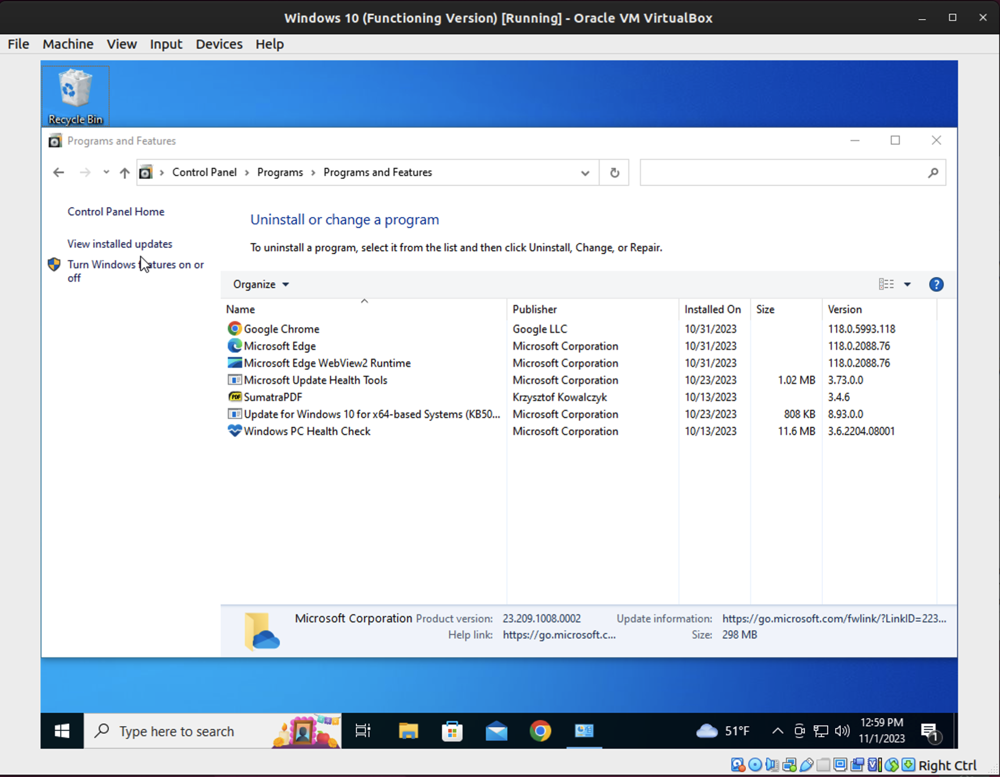
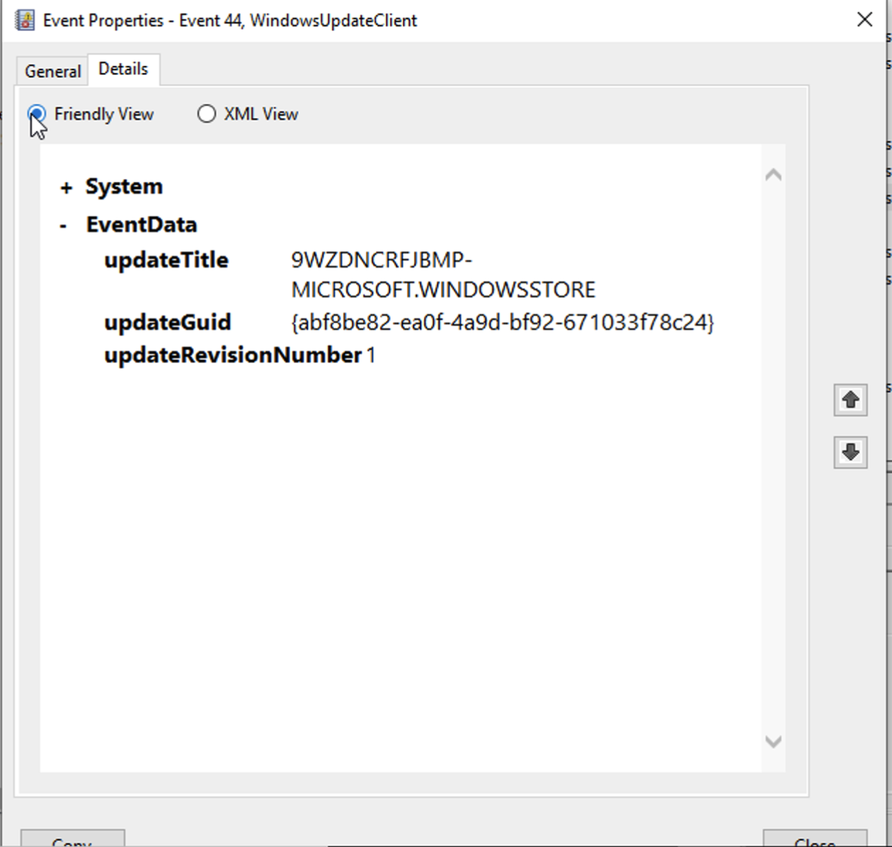

# Lab 8

**Part 1: Registry**

- Registry Files: `C:\Windows\System32\Config\`
- Windows Registry Hacks:
  - Switch windows with a single click on task bar
    - HKEY_CURRENT_USER\Software\Microsoft\Windows\CurrentVersion\Explorer\Advanced
      - Switch windows with a single click on the taskbar
        - Right click > New > DWORD (32-bit) > "LastActiveClick" > Double click > Change Value Data to 1 > OK
  - Remove 3D Object from PC
    - HKEY_LOCAL_MACHINE\SOFTWARE\Microsoft\Windows\CurrentVersion\Explorer\MyComputer\NameSpace
      - Locate {0DB7E03F-FC29-4DC6-9020-FF41B59E513A} in NameSpace
      - Right click > Delete
    - KEY_LOCAL_MACHINE\SOFTWARE\Wow6432Node\Microsoft\Windows\CurrentVersion\Explorer\MyComputer\NameSpace
      - Locate {0DB7E03F-FC29-4DC6-9020-FF41B59E513A} in NameSpace
      - Right click > Delete
  - Remove OneDrive from PC
    - Control Panel > Programs > Programs and Features > Uninstall OneDrive
  - Disable Bing
    - Computer\HKEY_CURRENT_USER\SOFTWARE\Policies\Microsoft\Windows\Explorer
    - Right click > New > DWORD (32-bit) > "DisableSearchBoxSuggestions" > Double click > Change Value Data to 1 > OK
  - Disable Cortana
    - Computer\HKEY_CURRENT_USER\SOFTWARE\Policies\Microsoft\Windows\Explorer
    - Right click > New > DWORD (32-bit) > "AllowCortana" > Double click > Change Value Data to 0 > OK

**Part 2: System Crash Analysis**

- Error: 0E : 016F : BFF9B3D4
  - 0E: The current thread attempted to access a pageable (or completely invalid) address at an interrupt request level (IRQL) that is too high. This is usually caused by drivers using improper addresses.
  - 016F: The address that the driver attempted to access.
  - BFF9B3D4: The IRQL at which the attempt to access the address in 2 occurred.

- Error: STOP 0x0000001A
  - STOP: The error that caused the system to stop.
  - 0x0000001A: "MEMORY_MANAGEMENT" error in Windows.  OS encountered an issue with managing the computer's memory.

- Error message: "This device cannot start. (Code 10)"
  - This error message is generated when the Device Manager can't start the hardware device, a situation usually caused by outdated or corrupted drivers. A device may also receive a Code 10 error if a driver generates an error that Device Manager doesn't understand. In other words, a Code 10 error can sometimes be a very generic message indicating some kind of unspecified driver or hardware problem.

- Error message "WU_E_NO_SERVICE"
  - Windows Update Agent was unable to provide the service.

**Part 3: System Log Analysis**
- Event 1
  - Level: Critical
  - Date and Time: 11/1/2023 12:14:27 PM
  - Source: Kernel-Power
  - Event ID 41
  - Task Category: (63)
  - General: The system has rebooted without cleanly shutting down first. This error could be caused if the system stopped responding, crashed, or lost power unexpectedly.
  - Details: I am not typing all of these out.
  - 

- Event 2
  - Level: Error
  - Date and Time: 10/12/2023 1:49:22 PM
  - Source: Service Control Manager
  - Event ID: 7023
  - Task Category: None
  - General: The Network List Service service terminated with the following error: The device is not ready.
  - Details: I am not typing all of these out.
  - 

- Event 3
  - Level: Warning
  - Date and Time: 11/1/2023 12:34:25 PM
  - Source: DNS Client Events
  - Event ID: 1014
  - Task Category: (1014)
  - General: Name resolution for the name t-ring-fallbacks2.msedge.net timed out after none of the configured DNS servers responded.
  - Details: I am not typing all of these out.
  - 

- Event 4
  - Level: Information
  - Date and Time: 10/13/2023 4:46:53 AM
  - Source: Kernel-General
  - Event ID: 16
  - Task Category: None
  - General: The access history in hive \??\C:\ProgramData\Microsoft\Windows\AppRepository...\ActivationStore.dat was cleared updating 0 keys and creating 0 modified pages.
  - Details: I am not typing all of these out.
  - 

  - Event 5
  - Level: Information
  - Date and Time: 10/31/2023 11:56:26 AM
  - Source: WindowsUpdateClient 
  - Event ID: 44
  - Task Category: Windows Update Agent
  - General: Windows Update started downloading an update.
  - Details: I am not typing all of these out.
  - 

- Viewing sys logs by event number can help see if there is a recurring problem.

- Filtering by timestamp can help you see when the problem occured and narrow down what was happening around that time that may have caused it.

Describe the contents of these subfolders of the Windows Logs:
- Application: This is where you can find logs for applications that are running on the computer.
- Security: This is where you can find logs for security related events.
- Setup: This is where you can find logs for the installation of Windows.
- System: This is where you can find logs for the Windows system components.
- Forwarded Events: This is where you can find events that have been forwarded from other computers.

Describe the contents of these subfolders of the Applications and Services Logs:
- Hardware Events: This folder contains logs related to hardware events and issues, such as driver errors, hardware failures, and system events triggered by hardware components.

- Internet Explorer: Logs related to the Internet Explorer browser, including browser crashes, performance data, and security-related events.

- Key Management Service: Logs associated with the Key Management Service, which is used for Windows activation and licensing.

- Microsoft: This folder can contain various logs related to Microsoft services and applications. It's a broad category, and the specific contents may vary based on the installed Microsoft software.

- Microsoft Office Alerts: Logs related to Microsoft Office applications, including error messages, alerts, and information about Office program events.

- OpenSSH: Logs related to the OpenSSH server or client if it's installed on your Windows system. These logs can include information about SSH connections, authentication, and server/client activities.

- Windows PowerShell: Logs related to Windows PowerShell, a command-line shell and scripting language. These logs can contain information about PowerShell script executions, errors, and other events.

