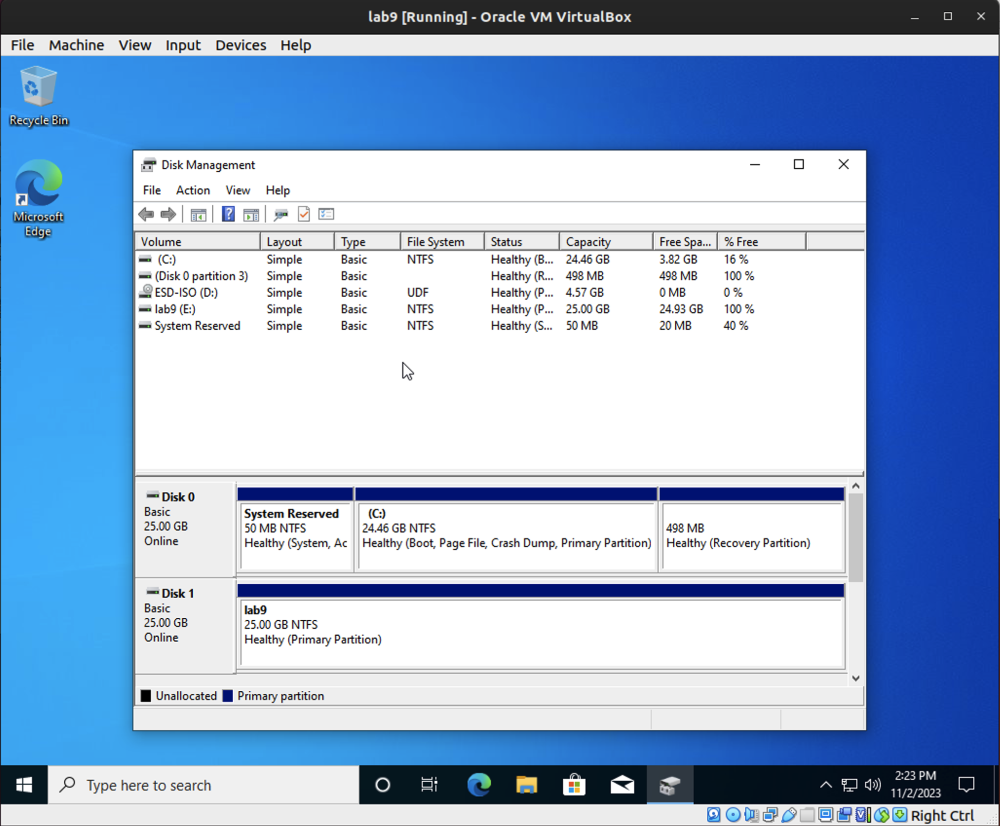

# Lab 9

**Workstation Deployment SOP**

**Scenario**
Name: Dwight Schrute
Job title: Assistant to the Regional Manager
Department: Sales
Start date: Three days from today
Hardware (VM) required: Desktop PC with a second internal hard drive for data backup purposes
You are to follow the SOP: [New Employee Computer and Email Configuration.](https://codefellows.github.io/ops-201-guide/curriculum/class-09/lab/SOP-new-employee.html)

### Objectives

- Prepare new VM 
  - Screenshot
    - VM storage configuration
    - Windows user profile configuration
    - Second internal hard drive installed and accessible from Dwights user profile
    - Windows user management
      - Password-protected user profile
      - Password-protected administrator profile
    - Thunderbird client
    - Configure an automatic email signature for the new hire
    - RDP settings

**New User**
- Computer Management > Right Click Users > Fill out form

**Thunderclient**
- cyberfellow.lab@outlook.com
- password12345678910 
- IMAP

**Welcome Email**

Dwight,

Welcome to the team.  Great stuff.  

Regards,
The Team

